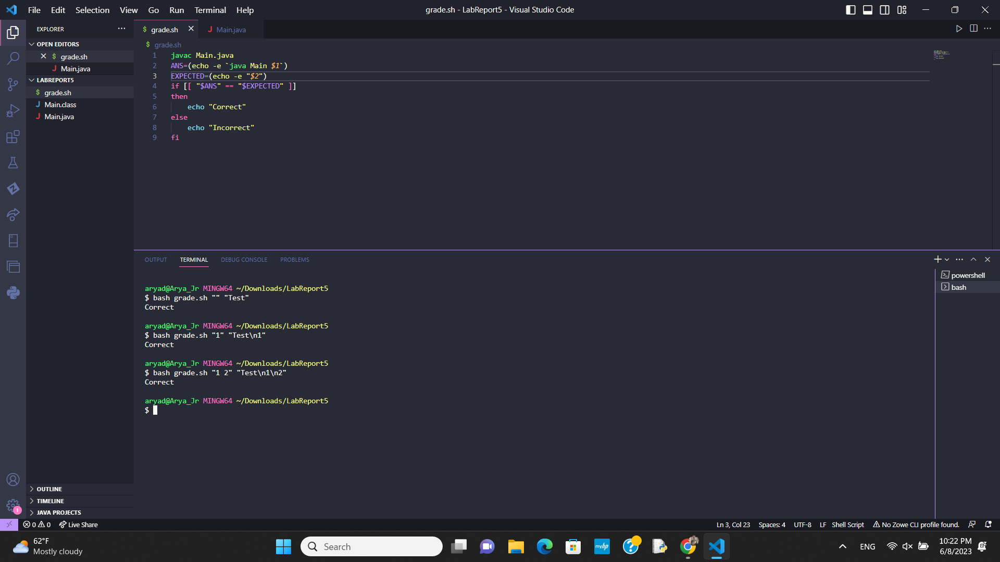

# Part 1
## Original Post
\
My code should output "Test", followed by each of the arguments on each new line\
I am having trouble because the bash script is not working when my output has newline characters.\
How should I deal with this?
## TA Help
I am not sure how you are implementing new lines, but perhaps the problem is that the newline characters are not the same\
## "Solved"
\
Yay!!!\
Thank you so much!!\
It turns out that bash was unable to interpet the newline characters from the output in the same format as the input text\
To fix this, i used the `echo -e "$VAR"` command to read in the different newline characters and read them in the same way\
## The Twist
There is actually a huge problem that the TA would never find out about\
\
There is nothing more to this problem than the java and bash files, and no other commands were run other than those shown in the screenshots above\
However, the 'fixed' grader is actually flawed, and is not able to correctly grade the java file\
This is because there is also a bug in the java file, where the student added a '\n' character after each println\
This means that the output actually had 2 newlines, not 1, between arguments, as shown below:\
Furthermore, the `echo` command was missing the `$` before the parentheses, so both `$ANS` and `$EXPECTED` had values of "echo"\
Finally, the correct newline character is actually "\r\n"\

## Full Solution
First, the java file should remove the `+"\n"` from the println\
Secondly, the bash script should use the term `$(echo -e "$2")`\
Finally, the input itslf should be changed to `bash grade.sh "1" "Test\r\n1"`\
Here is the solution manifested:\

# Part 2
I have been avoiding vim like the plague, so it is pretty cool to have learned.\
After asking some of my family members who specialized in CS when I went back home, almost none of them had ever used it, with one family friend saying that he had used it once ever to fix a very important code in a time crunch because his company couldn't edit the code through a normal IDE.\
This is cool, because he works for Microsoft, so that means that maybe if I can get good at Vim, I can one day work for Microsoft\
All funny business aside, I am pretty excited. It's actually not as bad as it seemed, although I'm sure it will get much worse if I ever do try and learn more.
